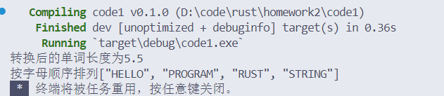
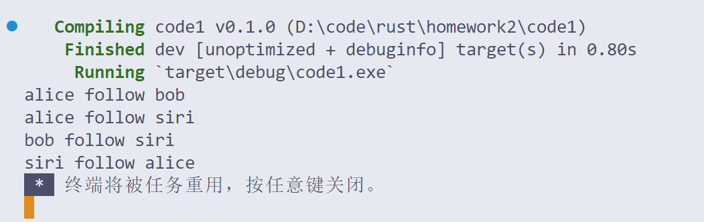
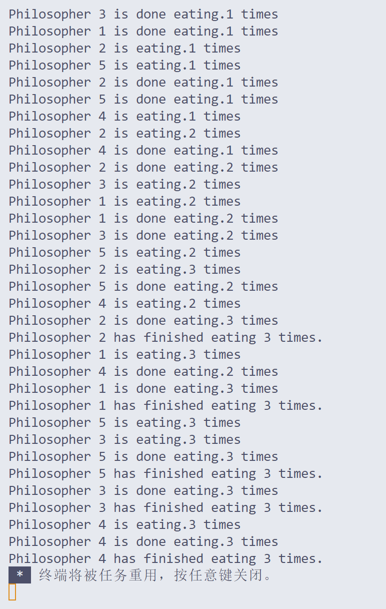

# Rust assignment2

### 姓名：向胤兴    学号：2215012469  


### 选择题
1. What is the purpose of an enum?
   - 答案: c. All of the above

2. Which of the following are characteristics of matching?
   - 答案: d. All of the above

3. What do generics allow us to have?
   - 答案: a. Generics allow us to have stand in types for our concrete types, which allows our code to be able to operate on many different types.

4. What are traits?
   - 答案: b. A capability, something a type can do, and can be shared with other types.

5. Which of the following are characteristics of closures?
   - 答案: d. All of the above

6. What best describes a pointer?
   - 答案: c. The memory address of some data

7. Which symbol dereferences a pointer?
   - 答案: c. *

8. Are pointer addresses stored on the heap or the stack?
   - 答案: b. Stack

9. What is the difference between Rc and Arc?
   - 答案: b. Rc is not thread safe and Arc is thread safe

10. What is the difference between concurrency and parallel programming?
    - 答案: a. Concurrency is the ability for different parts of a program to execute independently. Parallel programming is where different parts of a program execute at the same time

11. What are channels?
    - 答案: a. Message passing where threads communicate by sending each other messages containing data through two ends, a receiver and transmitter

12. Why are mutexes important?
    - 答案: c. Allows only one thread access to some data as long as the thread obtains the lock

### 解答题
13. **Smart pointers 是什么？它和 reference 的区别是什么？并简要阐述 Box<T>、Rc<T>、Ref<T>的区别。**

   **回答**:
   - Smart pointers 是一种数据结构，除了指向一个对象之外，还能够拥有该对象，负责对象的生命周期管理。相比普通引用（reference），智能指针可以自动管理资源的释放。
   - `Box<T>`: 用于在堆上分配内存，它的所有权是唯一的，适用于拥有单一所有权的数据。
   - `Rc<T>`: 是一个引用计数类型，实现了多所有权，可以让多个所有者共享同一个数据，适用于单线程环境。
   - `Ref<T>`: Ref是对RefCell的借用，允许在运行时进行可变借用检查，而不是编译时，适用于单线程内部可变性。

14. **Rust 的错误处理机制包括哪些？它们都分别用于什么情况？**

   **回答**:
   - Rust 的错误处理机制主要包括 `Result` 和 `Option` 类型。
   - `Result<T, E>`: 用于处理可能会失败的操作，`Ok(T)` 表示成功，`Err(E)` 表示失败。
   - `Option<T>`: 用于处理可能为空的值，`Some(T)` 表示有值，`None` 表示无值。

15. **Macros 是什么？请你说明在 rust 中 macros 和 function 的相同点和不同点，并简要阐述 Rust 和 C 语言中 macros 的区别。**

   **回答**:
   - Macros 是一种元编程工具，允许写出可以生成其他代码的代码。
   - 相同点：两者都可以复用代码，减少重复。
   - 不同点：宏是在编译时展开的，可以生成复杂的代码结构；函数是在运行时调用的，具有明确的参数和返回值类型。
   - 区别：Rust 中的宏更为安全和强大，可以避免 C 语言宏中的一些常见问题，如类型安全问题和预处理器的简单文本替换。

### 代码题

16. **迭代器操作**

```rust

fn main() {
    let words=vec!["hello".to_string(),
    "rust".to_string(),
    "program".to_string(),
    "string".to_string(),
    "en".to_string(),];
    let filter_words:Vec<String>=
    words.iter().filter(|word| word.len()>3).map(|word| word.to_uppercase()).collect();
    let total_length:usize=filter_words.iter().map(|word| word.len()).sum();
    let average=total_length as f64/filter_words.len() as f64;
    println!("转换后的单词长度为{:?}", average);
    let mut sorted_words =filter_words.clone();
    sorted_words.sort();
    println!("按字母顺序排列{:?}",sorted_words);
}

```

### 控制台输出截图

  
代码分析：  
由于words需要多次使用，使用iter迭代器进行遍历。使用filter筛选出Vec中字符长度超过三的string对象，使用map对其进行操作。


17. **社交网络**

```rust
use std::cell::RefCell;
use std::rc::Rc;

struct User{
    name:String,
    friends:RefCell<Vec<Rc<Box<User>>>>,
}
impl User{
    fn new(name:&str)-> Rc<Box<User>>{
        Rc::new(Box::new(User{
            name: name.to_string(),
            friends: RefCell::new(vec![]),
        }))
    }

    fn follow(&self, user:Rc<Box<User>>)
    {
        self.friends.borrow_mut().push(user);
    }

    fn show_friends(&self){
        let friends=self.friends.borrow();
        for friend in friends.iter(){
            println!("{} follow {}",self.name,friend.name);
        }
    }
}
fn main() {
    let alice=User::new("alice");
    let bob=User::new("bob");
    let siri=User::new("siri");
    alice.follow(bob.clone());
    alice.follow(siri.clone());
    bob.follow(siri.clone());
    siri.follow(alice.clone());
    alice.show_friends();
    bob.show_friends();
    siri.show_friends();
}

```

### 控制台输出截图

  


18. **哲学家就餐问题**

```rust
use std::sync::{Arc, Mutex};
use std::thread;
use std::time::Duration;

struct Philosopher{
    name:String,
    left:usize,
    right:usize,
    meals_eaten:usize,
}
impl Philosopher{
    fn new(name:&str,left:usize,right:usize)->Philosopher
    {   Philosopher{
        name: name.to_string(),
        left: left,
        right: right,
        meals_eaten: 0,
    }
}

    fn eat(&mut self ,table:&Table)->bool{
        let left_fork=table.forks[self.left].try_lock();
        if let Ok(_left)=left_fork{
            let right_fork=table.forks[self.right].try_lock();
            if let Ok(_right)=right_fork{
                println!("{} is eating.{} times",self.name,self.meals_eaten+1);
                thread::sleep(Duration::from_millis(1000));
                println!("{} is done eating.{} times",self.name,self.meals_eaten+1);
                self.meals_eaten +=1;
                return self.meals_eaten<3;
            }
            else {
                drop(_left);
                thread::sleep(Duration::from_millis(10));
                self.meals_eaten<3
            }
        }
        else{
            thread::sleep(Duration::from_millis(10));
            self.meals_eaten<3
        }
     }
    }

struct Table{
    forks:Vec<Mutex<()>>,
}

fn dine(){
    let table=Arc::new(Table{
        forks:vec![
            Mutex::new(()),
            Mutex::new(()),
            Mutex::new(()),
            Mutex::new(()),
            Mutex::new(()),
        ]
    });
    let Philosophers=vec![
        Philosopher::new("Philosopher 1",0,1),
        Philosopher::new("Philosopher 2",1,2),
        Philosopher::new("Philosopher 3",2,3),
        Philosopher::new("Philosopher 4",3,4),
        Philosopher::new("Philosopher 5",4,0),
    ];

    let handles:Vec<_>=Philosophers.into_iter().map(|mut p|{
        let table=table.clone();
        thread::spawn(move ||{
            while p.eat(&table){
                thread::sleep(Duration::from_millis(1000))
            }
            println!("{} has finished eating 3 times.",p.name)
        })
    })
    .collect();
for h in handles{
    h.join().unwrap()
}
}
fn main(){
    dine();
}
```

### 控制台输出截图


### 代码分析
设计了每个哲学家会吃三次饭，然后完成就餐，不再拿筷子。
#### 防止死锁的方法
打破的**占有并等待**的死锁条件，每个哲学家先拿左手的筷子再拿右手筷子，如果成功拿到左手筷子而没有拿到右手筷子时，就会放下左手的筷子，等待一定时间后再次尝试拿起筷子吃饭。