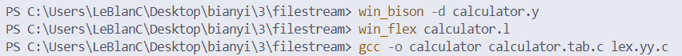
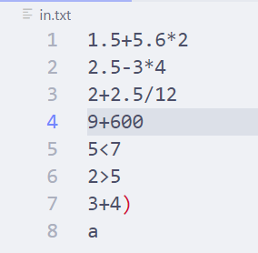
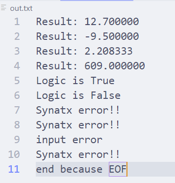

# 实验报告：基于 Flex 和 Bison 实现一个支持加减乘除和关系运算的计算器

## 实验目的  
本实验旨在通过使用 Flex 和 Bison 实现一个简单的计算器程序。该计算器应支持基本的加减乘除运算、括号、负号、关系运算符（如 <、<=、>、>=、==、!=）等操作，并能正确处理小数、运算符优先级和结合性。此外，还需要考虑出错情况，包括识别运算符中的字母等不能运算的内容。

## 实验内容
1.	支持的运算：  
•	加法 +<br>
•	减法 -<br>
•	乘法 *<br>
•	除法 /<br>
•	括号 ( 和 )<br>
•	关系运算符 <、<=、>、>=、==、!=<br>
•	负号 -<br>

2.	需要考虑的特性：
•	小数处理
•	运算符的结合性和优先级
3.	出错处理：
•	识别并处理非法字符
•	报告语法错误

## 实验步骤
### 1. 词法分析（Lex）  
使用 Flex 定义词法分析器，识别输入中的各种词素（token），包括数字、运算符、括号等，并处理非法字符。  

### 创建 calculator.l 文件，内容如下：
```%{
#include "calculator.tab.h"
void yyerror(const char *s);
%}

%%

[0-9]+"."[0-9]+       { yylval.dval = atof(yytext); return FLOAT; }
[0-9]+                { yylval.dval = atof(yytext); return INTEGER; }
"("                   { return LPAREN; }
")"                   { return RPAREN; }
"+"                   { return PLUS; }
"-"                   { return MINUS; }
"*"                   { return MULTIPLY; }
"/"                   { return DIVIDE; }
"<"                   { return LESS; }
">"                   { return GREATER; }
"<="                  { return LESS_EQUAL; }
">="                  { return GREATER_EQUAL; }
"=="                  { return EQUAL; }
"!="                  { return NOT_EQUAL; }
"\n"                  {return CR;}
"\r"                  {return RC;}
[ \t]               ; // ignore whitespace
<<EOF>>                {return EOF_TOKEN;}
.                     { yyerror("Invalid character"); return EROOR; }

%%
```
  
    

### 2. 语法分析（Bison）  
使用 Bison 定义语法分析器，处理词法分析器识别出的词素，构建表达式
的语法树，并计算表达式的值。  
### 创建 calculator.y 文件，内容如下：
```
%{
#include <stdio.h>
#include <stdlib.h>
#include <math.h>
#include<stdbool.h>
extern FILE *yyin;
extern FILE *yyout;
int yylex();
void yyerror(const char *s);
int yywrap(void);
double result = 0.0;

%}

%union {
    double dval;
    int ival;
}

%token <dval> INTEGER
%token <dval> FLOAT
%token LPAREN RPAREN
%token PLUS MINUS MULTIPLY DIVIDE CR EOF_TOKEN RC ERROR
%token LESS GREATER LESS_EQUAL GREATER_EQUAL EQUAL NOT_EQUAL
%left PLUS MINUS
%left MULTIPLY DIVIDE
%left UMINUS
%type <dval> expr
%type <ival> rela

%%

line_list:line_list line
        |line
        ;

line: expr  EOF_TOKEN { fprintf(yyout,"Result: %lf\nend because EOF", $1); exit(0);}
    | expr  CR{fprintf(yyout,"Result: %lf\n", $1); }
    | rela  CR{ if($1) fprintf(yyout,"Logic is True\n");else fprintf(yyout,"Logic is False\n");}
    | rela  EOF_TOKEN   { if($1) fprintf(yyout,"Logic is True\n");else fprintf(yyout,"Logic is False\n"); exit(0);}
    ;
rela: expr LESS expr           { $$ = $1 < $3; }
    | expr GREATER expr        { $$ = $1 > $3; }
    | expr LESS_EQUAL expr     { $$ = $1 <= $3; }
    | expr GREATER_EQUAL expr  { $$ = $1 >= $3; }
    | expr EQUAL expr          { $$ = $1 == $3; }
    | expr NOT_EQUAL expr      { $$ = $1 != $3; }
    ;
expr: error {fprintf(yyout,"Synatx error!!\n");}
    |ERROR {fprintf(yyout,"Synatx error\n");}
    |expr PLUS expr       { $$ = $1 + $3; }
    | expr MINUS expr      { $$ = $1 - $3; }
    | expr MULTIPLY expr   { $$ = $1 * $3; }
    | expr DIVIDE expr     { $$ = $1 / $3; }
    | LPAREN expr RPAREN   { $$ = $2; }
    | MINUS expr %prec UMINUS { $$ = -$2; }
    | INTEGER              { $$ = $1; }
    | FLOAT                { $$ = $1; }
    ;
    
%%

int main() {
    FILE *file1,*file2;
    file1=fopen("in.txt","r");
    file2=fopen("out.txt","w");
    yyin = file1;
    yyout = file2;
    yyparse();
    yywrap();
}

void yyerror(const char *s) {
    fprintf(stderr, "Error: %s\n", s);
}
int yywrap(void){
    return 1;
}
```

### 关键代码分析：<br>

### 词法分析器定义 (calculator.l)

#### 关键功能代码分析：
Flex工具关键代码：
```
[0-9]+"."[0-9]+       { yylval.dval = atof(yytext); return FLOAT; }
[0-9]+                { yylval.dval = atof(yytext); return INTEGER; }
```
### 代码分析  <br>
识别到指定格式数字后，使用C语言的atof函数将读入的字符转为浮点数，传递到yylval中，在.y文件中可以使用对应值。  

### Bison工具关键代码：
```
%type <dval> expr
%type <ival> rela

%%

line_list:line_list line
        |line
        ;

line: expr  EOF_TOKEN { fprintf(yyout,"Result: %lf\nend because EOF", $1); exit(0);}
    | expr  CR{fprintf(yyout,"Result: %lf\n", $1); }
    | rela  CR{ if($1) fprintf(yyout,"Logic is True\n");else fprintf(yyout,"Logic is False\n");}
    | rela  EOF_TOKEN   { if($1) fprintf(yyout,"Logic is True\n");else fprintf(yyout,"Logic is False\n"); exit(0);}
    ;
rela: expr LESS expr           { $$ = $1 < $3; }
    | expr GREATER expr        { $$ = $1 > $3; }
    | expr LESS_EQUAL expr     { $$ = $1 <= $3; }
    | expr GREATER_EQUAL expr  { $$ = $1 >= $3; }
    | expr EQUAL expr          { $$ = $1 == $3; }
    | expr NOT_EQUAL expr      { $$ = $1 != $3; }
    ;
expr: error {fprintf(yyout,"Synatx error\n");}
    |expr PLUS expr       { $$ = $1 + $3; }
    | expr MINUS expr      { $$ = $1 - $3; }
    | expr MULTIPLY expr   { $$ = $1 * $3; }
    | expr DIVIDE expr     { $$ = $1 / $3; }
    | LPAREN expr RPAREN   { $$ = $2; }
    | MINUS expr %prec UMINUS { $$ = -$2; }
    | INTEGER              { $$ = $1; }
    | FLOAT                { $$ = $1; }
    ;
%%
```
#### 代码分析
    %type <dval> expr
    expr: ERROR {fprintf(yyout,"Synatx error\n");}
    |expr PLUS expr       { $$ = $1 + $3; }
    | expr MINUS expr      { $$ = $1 - $3; }
    | expr MULTIPLY expr   { $$ = $1 * $3; }
    | expr DIVIDE expr     { $$ = $1 / $3; }
    | LPAREN expr RPAREN   { $$ = $2; }
    | MINUS expr %prec UMINUS { $$ = -$2; }
    | INTEGER              { $$ = $1; }
    | FLOAT                { $$ = $1; }
    ;
此部分主要负责数学运算，$$=...表示将归约到的expr赋值为=之后的结果。  
此部分还作为错误匹配，如果传入了无法匹配的字符，将会匹配到ERROR,输出错误。

    %type <ival> rela   
    rela: expr LESS expr           { $$ = $1 < $3; }
    | expr GREATER expr        { $$ = $1 > $3; }
    | expr LESS_EQUAL expr     { $$ = $1 <= $3; }
    | expr GREATER_EQUAL expr  { $$ = $1 >= $3; }
    | expr EQUAL expr          { $$ = $1 == $3; }
    | expr NOT_EQUAL expr      { $$ = $1 != $3; }
    ;
此部分代码主要用于逻辑运算。由于Bison工具中直接使用int类型的1和0表示bool类型的true和false。故rela声明为ival类型非终结符。  

```
line: expr  EOF_TOKEN { fprintf(yyout,"Result: %lf\nend because EOF", $1); exit(0);}
```
此段作为判别中止条件。当识别到文件终止符时，程序结束。


### 3. 构建和运行
1.	生成词法分析器和语法分析器：
2.	运行计算器：

4. 示例输入和输出<br>
in.txt:  
  
out.txt:  
  
### 输出分析
对于  

实验关键语法思路分析<br>
1.	括号的语法规则和赋值行为：<br>
•	使用 LPAREN 和 RPAREN 处理括号，确保表达式的优先级。<br>
•	在 Bison 中定义括号的语法规则，使得括号内的表达式被正确解析和计算。  

2.	终结符识别和错误处理：<br>
•	在 Lex 文件中定义终结符（如 NUMBER、PLUS、MINUS 等）。<br>
•	处理非法字符和未识别的标识符，返回 ERROR token 并在 Bison 中处理。  

3.	运算符优先级和结合性：<br>
•	在 Bison 文件中使用 %left 和 %right 指定运算符的优先级和结合性。<br>
•	确保乘法和除法的优先级高于加法和减法，负号的优先级最高。  

#### 结论
通过本实验，我们成功地实现了一个支持加减乘除、括号、负号和关系运算的计算器。该计算器能够正确处理小数，并根据运算符的优先级和结合性计算表达式的值。此外，程序还具备良好的错误处理能力，能够识别并报告非法字符和未识别的标识符，增强了程序的健壮性和用户体验。
代码文件

实验顺利完成，达到了预期的目标。

