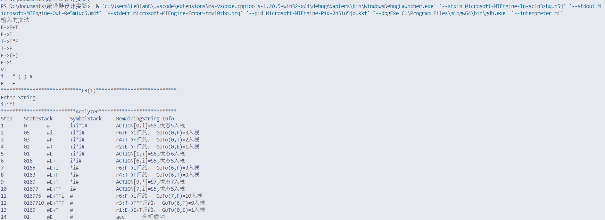

# 第四次实验
## 实验要求
根据提供的slrs.cpp，可输出2种以上的文法SLR(1)分析表  
根据提供的slr-add.cpp，可输入自定义文法的SLR(1)分析表  
二者选择一种方法，实现分析表的打印输出即可。  

**本实用选择使用提供的slrs.cpp，输出2种不同文法**

## (1)原本程序内置文法
**测试样例：i+i*i**

**正确归约输出**

## (2)自行设计的第二种输出文法：
